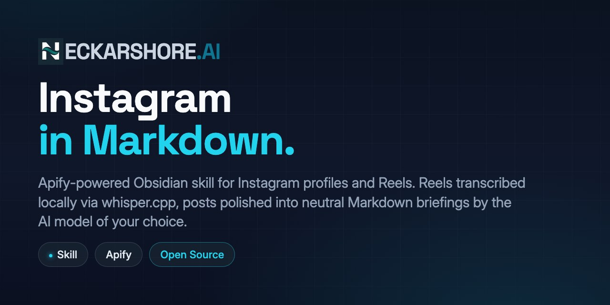

# obsidian-instagram-scraper

<p align="center">
  
</p>

> Scrape Instagram profiles (incl. **spoken transcripts of Reels**) into Obsidian-friendly Markdown notes.
> Part of the [neckarshore-ai](https://github.com/neckarshore-ai) Obsidian toolkit.

Companion to [obsidian-vault-autopilot](https://github.com/neckarshore-ai/obsidian-vault-autopilot).

## What it does

Pulls a profile's recent posts (incl. spoken transcripts of Reels via local [whisper.cpp](https://github.com/ggerganov/whisper.cpp)) from Instagram via the Apify actor `apify/instagram-scraper`, polishes each post into a neutral Markdown briefing via Anthropic Haiku, and renders everything as Obsidian-friendly notes — one folder per profile.

## Install

In Claude Code:

```
/plugin marketplace add neckarshore-ai/obsidian-instagram-scraper
```

```
/plugin install obsidian-instagram-scraper@neckarshore-ai
```

Run each command as a **separate Claude Code input** (one chat submission per command). Pasting both at once will mangle them into a single failing argument.

## Prerequisites

| What | Why | Where |
|---|---|---|
| Apify API token | Calls the `apify/instagram-scraper` actor | https://console.apify.com/account/integrations — set as `APIFY_API_TOKEN` |
| Anthropic API key | Polishes posts + extracts profile essence via Haiku | https://console.anthropic.com — set as `ANTHROPIC_API_KEY` |
| `whisper.cpp` binary | Transcribes Reel audio locally (free, offline) | [github.com/ggerganov/whisper.cpp](https://github.com/ggerganov/whisper.cpp) — installation guide in `skills/instagram-scraper/references/transcription.md` |
| Python 3.10+ with `requests` + `anthropic` | Skill runtime | `pip install -r skills/instagram-scraper/requirements.txt` |
| `OBSIDIAN_VAULT_PATH` env var | Output destination | Path to your local Obsidian vault root |

## Usage

In Claude Code, point it at a handle (single or batch):

```
scrape @chase.h.ai
scrape @chase.h.ai @innoone_gmbh @bryrobbie
```

Output lands in `${OBSIDIAN_VAULT_PATH}/Instagram Scraper/`.

## Output Structure

```
Instagram Scraper/
└── <username> — <essence>/
    ├── _<username> overview.json   # raw Apify response
    ├── _<username> overview.md     # profile card + posts index
    └── <date> <title-slug>.md      # one note per post (Reels carry the spoken transcript inline)
```

## Pricing

~$0.02 per profile via Apify (12-post scrape baseline); transcription is **free** (local `whisper.cpp`); optional Haiku post-polish adds ~$0.06 per 12-Reel profile.

## Architecture

The plugin ships:

- `skills/instagram-scraper/SKILL.md` — Claude Code skill manifest with triggers + workflow
- `skills/instagram-scraper/scripts/` — `scrape_profile.py`, `polish_post.py`, `essence_profile.py`, `render_report.py`, `transcribe_videos.py`
- `skills/instagram-scraper/_social_common/` — vendored shared utilities (canonical source at [obsidian-social-scrapers-common](https://github.com/neckarshore-ai/obsidian-social-scrapers-common))
- `scripts/sync-common.sh` — re-vendoring script for maintainers (pulls the latest common-lib release)

## See also

- [obsidian-linkedin-scraper](https://github.com/neckarshore-ai/obsidian-linkedin-scraper) — sister skill for LinkedIn
- [obsidian-vault-autopilot](https://github.com/neckarshore-ai/obsidian-vault-autopilot) — vault organization toolkit
- [obsidian-social-scrapers-common](https://github.com/neckarshore-ai/obsidian-social-scrapers-common) — shared utilities

## Legal & Compliance

This skill retrieves publicly visible Instagram content via the [Apify](https://apify.com/) infrastructure for **personal research and curation**. Output is written to your local Obsidian vault and is not redistributed.

| Platform | ToS Status | Action |
|---|---|---|
| Instagram | Restricted (Meta ToS prohibit unauthorized automated access) | Personal research use only |
| LinkedIn | Restricted | See [obsidian-linkedin-scraper](https://github.com/neckarshore-ai/obsidian-linkedin-scraper) |
| X (Twitter) | **Prohibited** since 2026-01-15 (USD 15,000 per 1M posts liquidated damages) | **Not included** in this public toolkit |

**GDPR (EU users):** You are the data controller for any scraped EU person. Article 14 GDPR requires you to inform them within one month. See [NOTICE.md](NOTICE.md) for full disclosure.

**Commercial use is not recommended** without independent legal review.

> Personal research use only. The maintainers disclaim liability for misuse, redistribution, or non-compliant processing.

## License

MIT — see [LICENSE](LICENSE).
